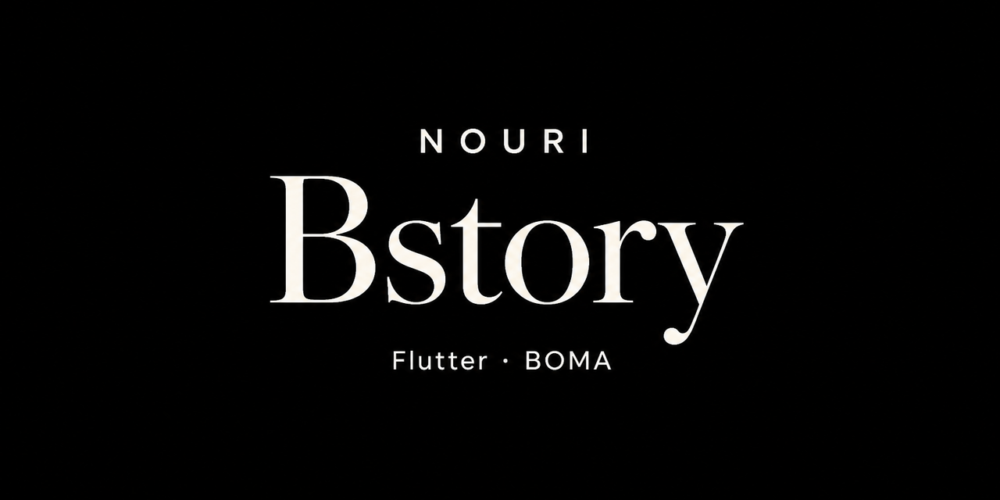

<p align="center">
  
</p>

# Bstory

Flutter client for styled story text. The product is **Bstory**. This repository is **BOMA**. Built for Nouri.

Type on a canvas. Choose a font. Apply a style. Place a sticker. Export a PNG.

The theme is dark. Phone OTP is wired; without `BOMA_API_BASE` the client stays offline. Premium screens exist. Features are currently unlocked.

## Editor

The home canvas is the product. A four-tab toolbar — font, style, color, create — opens the sheets around it. Drafts persist on device. Export writes a PNG to the gallery, the share sheet, or the clipboard.

## Companion

`server/` is a small Node process for OTP, a version check, and open/ping counts. The Flutter client calls it only when `BOMA_API_BASE` is set.

## Run

```bash
flutter pub get
flutter gen-l10n
flutter run
```

Flutter SDK ≥ 3.2.
